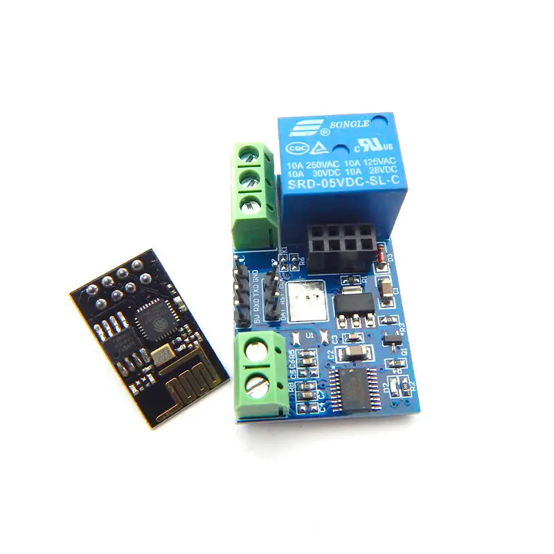

# SerialSmartRelay

**SerialSmartRelay** is a firmware source code for controlling a smart relay via a serial interface (UART) using the A0 protocol.

## Supported devices

**ESP8266 Relay V3**

**ESP8266 ESP-01 WIFI Wireless with 2CH Relay Module Board**

---

**Developed by** [UDFSOFT](https://udfsoft.com) _Copyright 2026 UDFOwner. Licensed under the Apache License 2.0._
